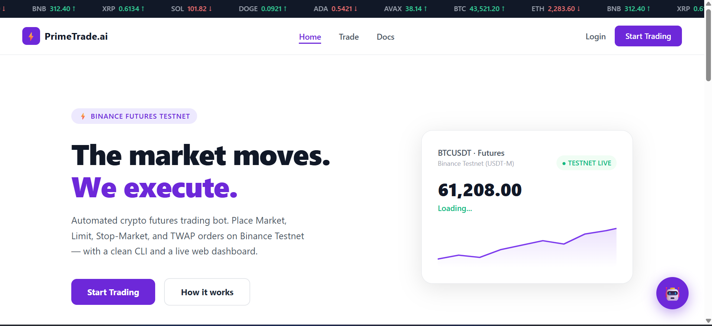
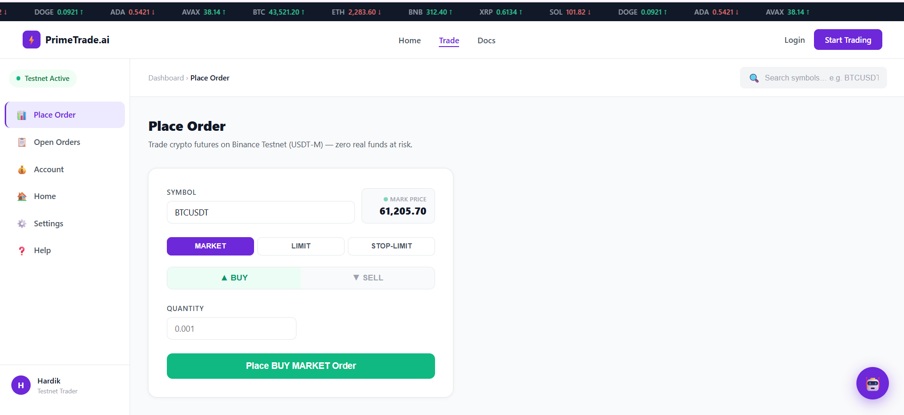
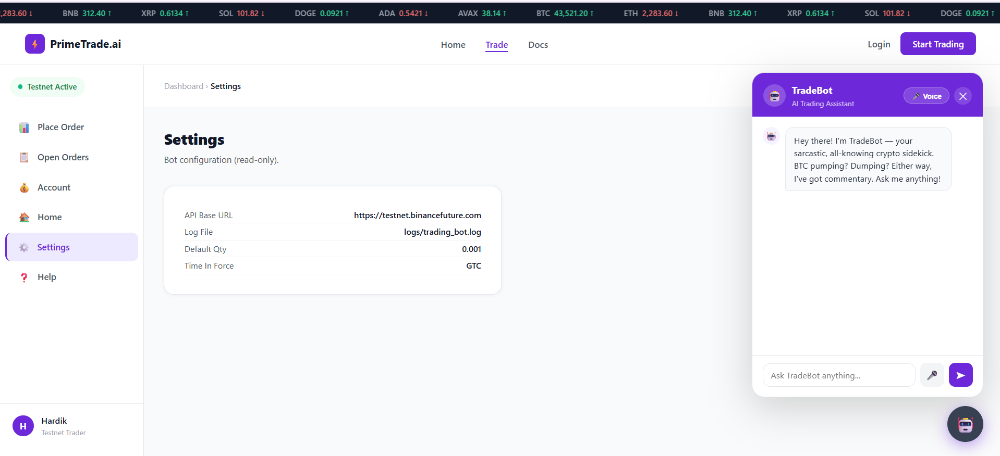
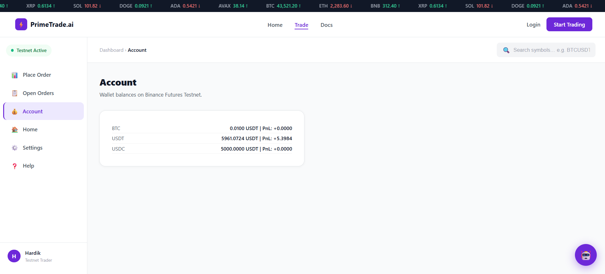

<p align="center">
  
  
  
  
  
  <a href="https://primetrade-ai-bot.vercel.app"></a>
  
</p>

<h1 align="center">⚡ PrimeTrade.ai — Binance Futures Trading Bot</h1>

<p align="center">
  <b>Automated crypto futures trading bot with Market, Limit, Stop-Market & TWAP orders · AI voice chatbot · Live web dashboard</b>
</p>

<p align="center">
  <a href="https://primetrade-ai-bot.vercel.app"><strong>🌐 Live Demo →</strong></a>
</p>

---

## What it does

PrimeTrade.ai is a full-stack trading bot for **Binance Futures Testnet (USDT-M)**. Place orders via a terminal CLI or a web dashboard — complete with an animated pipeline, live BTC price, and a voice-enabled AI chatbot.

```
Your Input → Validators → Bot Engine (HMAC signed) → Binance Testnet API → Order Filled
```

The full project lives in [`trading_bot/`](trading_bot/) — see [`trading_bot/README.md`](trading_bot/README.md) for the complete CLI reference, API docs, and HMAC signing details.

---

## Screenshots

| Landing Page | Trade Dashboard |
|---|---|
|  |  |

| AI Voice Chatbot | Account & Balances |
|---|---|
|  |  |

---

## Features

| Feature | Details |
|---|---|
| **4 Order Types** | Market, Limit, Stop-Market, TWAP (time-weighted slices) |
| **HMAC SHA256** | All requests signed per Binance Futures spec |
| **Input Validation** | Symbol regex, price/qty guards, side/type whitelist |
| **Rich CLI** | Typer + Rich coloured output, interactive prompt mode |
| **Flask Web UI** | Dark ticker bar, animated order pipeline, live BTC price card |
| **AI Voice Chatbot** | GPT-4o-mini brain + ElevenLabs voice + Web Speech API mic |
| **Structured Logging** | Rotating file handler (5 MB × 3 backups), per-request context |
| **Vercel Deployment** | Single serverless function via `@vercel/python` |

---

## Quick Start

```bash
git clone https://github.com/Hardik182005/primetrade.ai.git
cd primetrade.ai/trading_bot
pip install -r requirements.txt
cp .env.example .env   # fill in your API keys
python ui/app.py       # http://localhost:5000
```

See [`trading_bot/README.md`](trading_bot/README.md) for CLI usage, API endpoints, and deployment instructions.

---

## Deployment

Live on Vercel: **[primetrade-ai-bot.vercel.app](https://primetrade-ai-bot.vercel.app)** — a single serverless function (`@vercel/python`), see [`trading_bot/vercel.json`](trading_bot/vercel.json). Environment secrets (`BINANCE_API_KEY`, `BINANCE_API_SECRET`, `OPENAI_API_KEY`, `ELEVENLABS_API_KEY`) live encrypted in the Vercel project's Production environment — never committed to the repo.

---

## License

MIT © 2026 Hardik Hinduja
